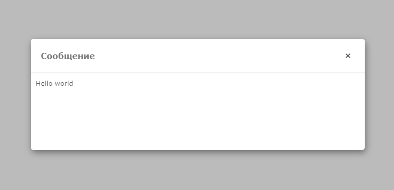
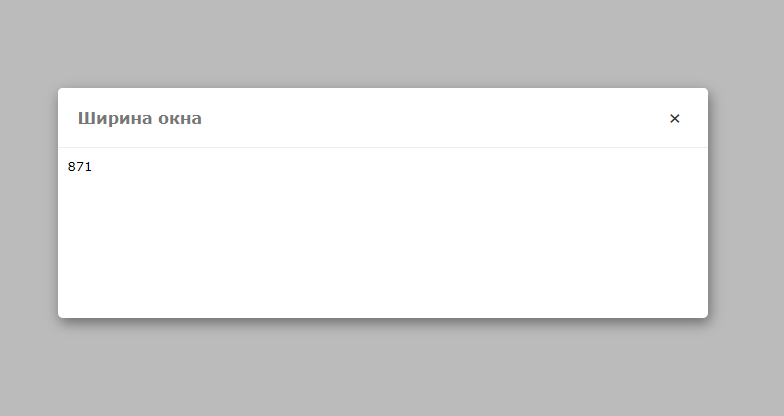
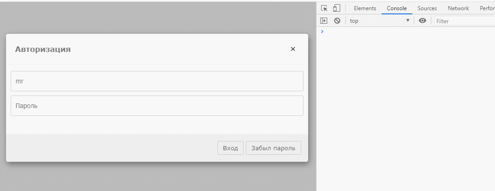
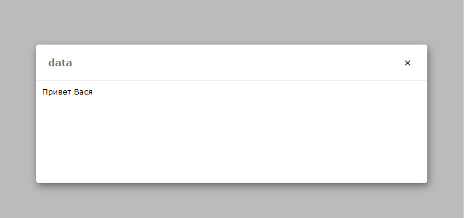
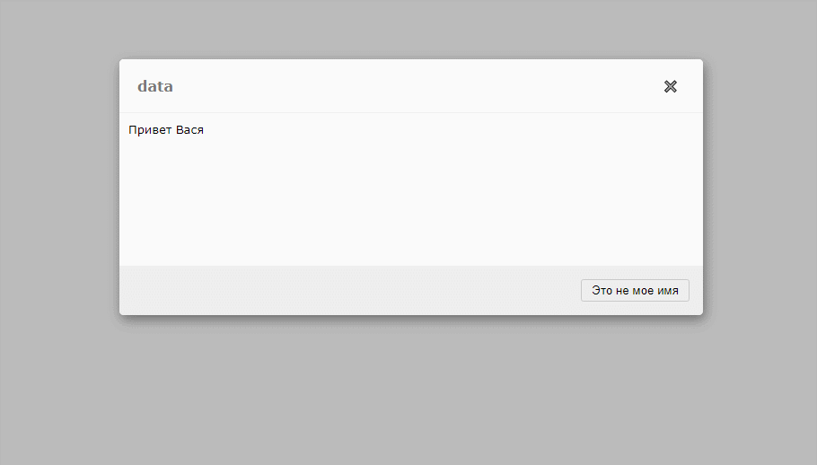
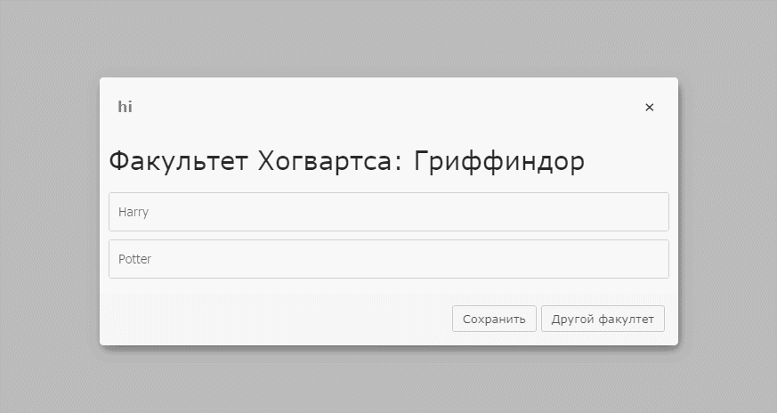

# Простое модальное окно для обозревателя.

Разбор по шагам

Шаг 1.  
В head нужно подключить два файла showDialog.js, showDialog.css  
Шаг 2.  
Функция showDialog принимает объект который может содержать следующие ключи  

title — заголовок  
message — сообщение или шаблон  
data — данные которые будут вставлены в шаблон  
buttons — кнопки  

Самый базовый пример  
Два аргумента title и message (строка)  

```js
showDialog({
    title: 'Сообщение', 
    message: "Hello world"
```



### message

message — может принимать несколько типов данных  


строки  
функции  
обещания  

Пример message — тип функция  

```js
showDialog({
    title: 'Ширина окна',
    message: () => document.body.offsetWidth
})
```




Пример message - тип обещание  

```js
showDialog({
    title: 'json с сервера',
    message: fetch('https://jsonplaceholder.typicode.com/todos/1')
})
```


### buttons

buttons — принимает объект
*  где ключ надпись на кнопке
*  а значение callback функция
которая будет вызвана при нажатии на кнопку

**Пример окна проверки**  
в message передадим строку в которой два input, у каждого input укажем атрибут name
(email и password)

```js
showDialog({
    title: 'Авторизация', 
    message: `<input type="text" placeholder="Логин" name="email">
              <input type="password" placeholder="Пароль" name="password">`,
    buttons: {
        'Вход': function(data){
            // Проверка данных 
            console.log('Данные', data)
        },
         'Забыл пароль': function(data){
            // Сброс пароля
        }
    }
})
```


При клике на [Вход] в консоли видим сообщение с данными которые мы ввели
при этом ключи это те самые "name" которые указали


### data

data — это объект который встраивается в шаблон по ключам  
К примеру в message мы можем указать строку как шаблон "Привет $name"  

```js
showDialog({
    title: 'data',
    message: 'Привет $name',
    data: {
        name: 'Вася'
    }
})
```



теперь добавим кнопку [Это не мое имя] при клике на эту кнопку выведем input где можно будет указать свое имя. Для этого можно воспользоваться встроенным методом right, для вызова боковой панели

```js
showDialog({
    title: 'data',
    message: 'Привет $name',
    data: {
        name: 'Вася'
    },
    buttons: {
        'Это не мое имя': function(data) {
            this.right({
                message: `<input type='text' name='name' placeholder='Введите свое имя'>`
                })
            }
        }
    })
```



this.right принимает объект с ключами message и buttons и по умолчанию добавляется кнопка "Сохранить".  
При нажатии на эту кнопку в data добавляются новые данные и основной шаблон перерисовывается.  


```js
showDialog({
    title: 'hi', 
    message: `<h2>Факультет Хогвартса: $faculty</h2>
              <input type="text" name="name" value="$name"><br>
              <input type="text" name="surname" value="$lastname">`,
    data: {
        name: "Harry",
        lastname: "Potter",
        faculty: "Гриффиндор"
    },
    buttons: {
        'Сохранить': function(data){
            console.log('save', data)
        },
        'Другой факультет': function(data){
            this.right({
                message: `
                    <select name='faculty'>
                        <option>Гриффиндор</option>
                        <option>Пуффендуй</option>
                        <option>Когтевран</option>
                        <option>Слизерин</option>
                    </select>
                `
            })
        }
    }
})
```


